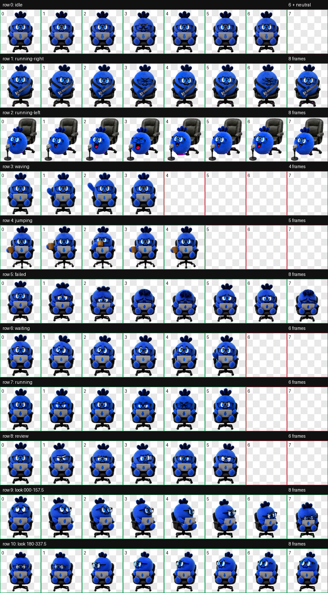

<p align="center">
  
</p>

<p align="center">
  老师们可以加群<br>
  突然好多人找我要，我估计会有 bug<br>
  有问题在群里问我就行，如果有版本更新我也会在群里说<br>
  我无限 token，随便改<br>
  下周抽空再做个 MaydayLand Codex 看板皮肤<br>
  想要什么也都可以跟我说 有空我就可以做
</p>

# mayday卜卜电子物料

一个非官方、非商业的五月天歌迷桌面项目。目前包含 Codex 动态宠物“卜卜”和 Codex 剩余额度面板；macOS、Windows 都可选择带或不带 BTC/ETH 行情的版本。



## 下载

请在项目右侧的 **Releases** 中选择对应系统：

- `Mayday-Bubu-macOS-Universal-v1.1.3.zip`：macOS 12.3+ 完整版，含 Codex 额度、任务进度与 BTC/ETH 行情，支持 Apple 芯片与 Intel Mac。
- `Mayday-Bubu-macOS-Universal-Codex-Only-v1.1.3.zip`：macOS 12.3+ 仅 Codex 版；保留额度和任务进度，不显示、也不请求 BTC/ETH 行情。
- `Mayday-Bubu-Windows-10-11-v1.1.3.zip`：Windows 10/11 完整版，含 Codex 额度、任务进度与 BTC/ETH 行情，支持 x64 与 ARM64。
- `Mayday-Bubu-Windows-10-11-Codex-Only-v1.1.3.zip`：Windows 10/11 仅 Codex 版；保留额度和任务进度，不显示、也不请求 BTC/ETH 行情。

四个压缩包的名称、根目录和安装入口都明确标注了系统或版本，不能混用。

## 使用方法

### macOS

1. 按需要下载并完整解压 macOS 完整版或 `Codex-Only` 版。
2. 双击 `安装卜卜-macOS.command`。
3. 如果出现“Apple 无法验证”提示，点“完成”，不要点“移到废纸篓”。
4. 双击包内的 `安装被拦截-打开隐私与安全.html`；页面会尝试自动跳转，如果没跳转就点蓝色按钮。
5. 在“隐私与安全”中点击“仍要打开”或“Open Anyway”，输入 Mac 登录密码，再重新双击安装文件。
6. 如果跳转仍有问题，双击 `如果仍无法打开-Apple官方步骤.webloc`。
7. 退出并重新打开 Codex。
8. 因为每个人设备、配置不同，可能会出现面板没有跟随卜卜的情况，可以跟 Codex 说：面板应该悬停在卜卜头顶，距离为 14px，你修复一下，并让面板一直跟随卜卜。

### Windows

1. 按需要下载并完整解压 Windows 完整版或 `Codex-Only` 版，不要在压缩包预览窗口中运行。
2. 双击 `安装卜卜-Windows.cmd`。
3. 完全退出并重新打开 Codex。
4. 公司电脑限制 PowerShell 时，可运行 `兼容安装-只装宠物.cmd`；宠物仍可使用，但不会安装额度面板。
5. 因为每个人设备、配置不同，可能会出现面板没有跟随卜卜的情况，可以跟 Codex 说：面板应该悬停在卜卜头顶，距离为 14px，你修复一下，并让面板一直跟随卜卜。

## 当前动作

- 默认：卜卜戴黑框眼镜，坐在完整办公椅上使用带蓝色萝卜标志的电脑。
- 鼠标悬停：卜卜拿起咖啡杯喝咖啡。
- 向左拖动：保留头顶三瓣装饰，变成无手脚圆球，在立式麦克风前唱歌。
- 向右拖动：变成无手脚圆球，弹奏深蓝色电吉他。
- 额度面板：跟随在卜卜头顶约 14 px，并随卜卜同比放大缩小；额度每 5 分钟更新，可隐藏和显示。
- 任务进度：约每 2 秒读取本机 Codex 任务索引，用每个任务的唯一 ID 对应左侧任务列表里的正式名称，并显示“正在执行”、“等你确认”或“已完成”；带蓝点、尚未查看的已完成任务会保留在面板底部，用户在 Codex 中点开该任务、蓝点消失后，面板同步移除该行。多个任务按开始时间依次向下排列，最多显示 5 行，超出部分合并提示。任务名称与已读状态只在本机读取和显示，不写入面板日志，也不上传；旧版 Codex 没有相关索引时才会回退到任务消息摘要与短时完成提示。
- 完整版另含每 5 秒更新的 BTC/ETH；`Codex-Only` 版会缩短面板并完全关闭行情请求。

## 性能与兼容性

- 宠物图集固定为 Codex v2 的 8×11、1536×2288 WebP；Mac 与 Windows 使用同一份已验证图集，避免跨平台动作变形。
- macOS 面板使用原生 AppKit，30 ms 跟随；除读取位置记录外，还会测量卜卜实际可见图像的大小，因此即使透明外层窗口没变，面板外框、文字、五个球、进度条、任务行、按钮和箭头也会随卜卜同比缩放。箭头始终对准可见中心并保持 14 个逻辑像素，兼容 Retina、外接屏和旧版 `anchor` 状态。
- Windows 面板使用每显示器 DPI v2 坐标，并测量透明窗口内卜卜的实际可见边界；系统 DPI 与宠物缩放分开计算后，再对整套 WPF 设计坐标做一次统一变换。桌面合成器逐帧跟随，并在软件渲染、远程桌面或低刷新率环境下启用 33 ms 定时兜底。
- 两个平台都不需要管理员权限，也不需要 API Key。

## 源码目录

- `shared/`：跨平台宠物图集与预览。
- `macos/`：AppKit 面板源码和安装器模板。
- `windows/`：WPF/PowerShell 面板源码和安装器模板。
- `scripts/`：构建、校验和隐私审计脚本。
- `dist/`：当前可直接下载的 Mac/Windows 压缩包。

## 开发与构建

macOS 需要 Xcode Command Line Tools：

```bash
./scripts/build-macos-release.sh
```

该命令会同时生成完整版和 `Codex-Only` 版两个 macOS 压缩包。

Windows 10/11 使用 Windows PowerShell 5.1：

```powershell
powershell -ExecutionPolicy Bypass -File .\scripts\build-windows-release.ps1
```

该命令会生成 Windows 完整版和 `Codex-Only` 版两个压缩包。

在 macOS 上只打包 Windows 分发文件时，也可运行 `./scripts/build-windows-release.sh`；Windows PowerShell 语法与 WPF 布局仍由 GitHub Actions 的 Windows 环境校验。

## 许可与声明

本项目的原创代码使用 MIT License。五月天名称、相关视觉元素、角色灵感和素材不属于 MIT 授权范围；项目与五月天、相信音乐及相关权利方无官方关系。发布或二次使用前请阅读 [ASSET-NOTICE.md](ASSET-NOTICE.md)。
