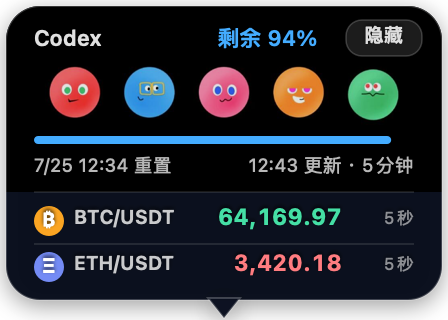

# 卜卜额度面板

跟随 Codex 宠物窗口的 macOS 原生额度与市场价格面板。



- 只显示 Codex 额度的剩余百分比和重置时间。
- 启动时立即读取，之后每 5 分钟自动更新。
- 面板底部显示 BTC/USDT 和 ETH/USDT 现货价格，每 5 秒更新；价格上涨时显绿、下跌时显红。
- 高频跟随宠物窗口，保持约 14 px 的头顶间距；宠物隐藏时面板也隐藏。
- 通过本机 `codex app-server` 的 `account/rateLimits/read` 读取数据，不需要 API Key，也不读取浏览器 Cookie。
- BTC 价格来自 Binance 公开 Spot Market Data 接口，不需要 API Key。
- 使用纯黑背景上的五个五月天角色球作为额度面板背景，去掉舞台和重复文字以保持简洁。
- 不修改 `/Applications/ChatGPT.app`，Codex 更新不会覆盖面板。

## 安装

```bash
./scripts/install.sh
```

安装后会注册当前用户的 LaunchAgent，并随登录自动启动。

当前安装位置：`~/Applications/卜卜额度面板.app`

## 数据自检

```bash
./build/卜卜额度面板.app/Contents/MacOS/BubuQuotaPanel --print-quota
./build/卜卜额度面板.app/Contents/MacOS/BubuQuotaPanel --print-btc
./build/卜卜额度面板.app/Contents/MacOS/BubuQuotaPanel --print-eth
```

## 卸载

```bash
./scripts/uninstall.sh
```
