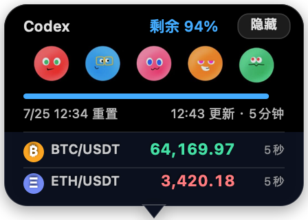

# 橙色卜卜额度面板

跟随 Codex 宠物窗口的 macOS 原生额度与市场价格面板。



- Codex 剩余额度显示在椅侧“回到那一天”蓝色飞机票根上，头顶面板只保留进行中任务与可选市场行情。
- 启动时立即读取，之后每 5 分钟自动更新。
- 面板底部显示 BTC/USDT 现货价格，每 5 秒更新；价格上涨时显绿、下跌时显红。
- 设置环境变量 `BUBU_SHOW_MARKET_PRICES=false` 后，面板会缩短为仅 Codex 额度版，并停止自动请求 BTC。
- 高频跟随宠物窗口，箭头对齐可见宠物中心，尖端到头顶固定 14 个逻辑像素；真实窗口不可读时使用 Codex 保存的位置，退出 Codex 后面板自动消失。
- 点击“隐藏”会完全收起窗口，不再保留桌面小方块；点击菜单栏“卜卜”可恢复显示。
- 启动后写入不含个人数据的运行状态文件，供安装器确认进程确实已启动。
- 通过本机 `codex app-server` 的 `account/rateLimits/read` 读取数据，不需要 API Key，也不读取浏览器 Cookie。
- BTC 价格来自 Binance 公开 Spot Market Data 接口，不需要 API Key。
- 面板使用低透明度泳池水纹背景；默认飞机是从批准设计稿提取的 342×284 透明材质，保留纸纹、阴影和金属夹。左拖时改用无夹具飞行版，额度数字与进度下划线继续动态绘制，并在 0.8 秒内从右向左播放一次。
- 不修改 `/Applications/ChatGPT.app`，Codex 更新不会覆盖面板。

## 安装

```bash
./scripts/install.sh
```

安装后会注册当前用户的 LaunchAgent，并随登录自动启动。如果旧蓝色卜卜面板仍在运行，安装器只暂停它的登录服务并保留全部蓝色项目文件；卸载橙色卜卜后会恢复原服务。

当前安装位置：`~/Applications/橙色卜卜额度面板.app`

## 数据自检

```bash
./build/橙色卜卜额度面板.app/Contents/MacOS/OrangeBubuQuotaPanel --print-quota
./build/橙色卜卜额度面板.app/Contents/MacOS/OrangeBubuQuotaPanel --print-btc
./build/橙色卜卜额度面板.app/Contents/MacOS/OrangeBubuQuotaPanel --print-panel-location
./build/橙色卜卜额度面板.app/Contents/MacOS/OrangeBubuQuotaPanel --print-saved-panel-location
./build/橙色卜卜额度面板.app/Contents/MacOS/OrangeBubuQuotaPanel --self-test-placement
```

## 卸载

```bash
./scripts/uninstall.sh
```
